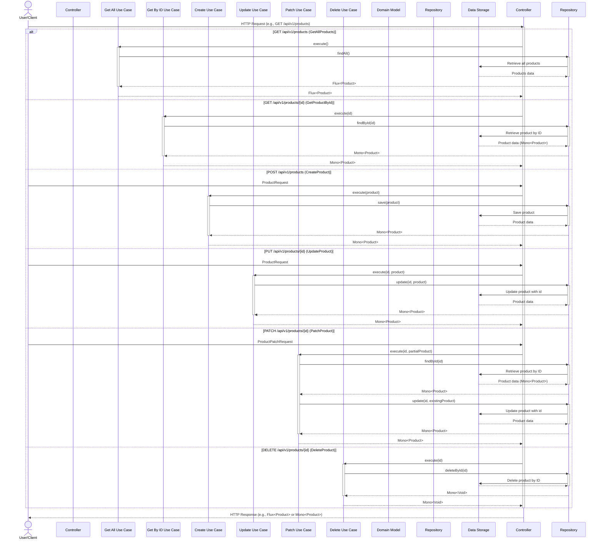

## Spring Boot Reactive Application Architecture

```mermaid
sequenceDiagram
    actor User/Client
    participant ProductController as Controller
    participant GetAllProducts as Get All Use Case
    participant GetProductById as Get By ID Use Case
    participant CreateProduct as Create Use Case
    participant UpdateProduct as Update Use Case
    participant PatchProduct as Patch Use Case
    participant DeleteProduct as Delete Use Case
    participant Product as Domain Model
    participant InMemoryProductRepository as Repository
    participant InMemoryData as Data Storage

    User/Client->>Controller: HTTP Request (e.g., GET /api/v1/products)
    activate Controller

    alt GET /api/v1/products (GetAllProducts)
        Controller->>GetAllProducts: execute()
        activate GetAllProducts
        GetAllProducts->>Repository: findAll()
        activate Repository
        Repository->>InMemoryData: Retrieve all products
        InMemoryData-->>Repository: Products data
        deactivate Repository
        Repository-->>GetAllProducts: Flux<Product>
        deactivate GetAllProducts
        GetAllProducts-->>Controller: Flux<Product>
    else GET /api/v1/products/{id} (GetProductById)
        Controller->>GetProductById: execute(id)
        activate GetProductById
        GetProductById->>Repository: findById(id)
        activate Repository
        Repository->>InMemoryData: Retrieve product by ID
        InMemoryData-->>Repository: Product data (Mono<Product>)
        deactivate Repository
        Repository-->>GetProductById: Mono<Product>
        deactivate GetProductById
        GetProductById-->>Controller: Mono<Product>
    else POST /api/v1/products (CreateProduct)
        User/Client->>Controller: ProductRequest
        Controller->>CreateProduct: execute(product)
        activate CreateProduct
        CreateProduct->>Repository: save(product)
        activate Repository
        Repository->>InMemoryData: Save product
        InMemoryData-->>Repository: Product data
        deactivate Repository
        Repository-->>CreateProduct: Mono<Product>
        deactivate CreateProduct
        CreateProduct-->>Controller: Mono<Product>
    else PUT /api/v1/products/{id} (UpdateProduct)
        User/Client->>Controller: ProductRequest
        Controller->>UpdateProduct: execute(id, product)
        activate UpdateProduct
        UpdateProduct->>Repository: update(id, product)
        activate Repository
        Repository->>InMemoryData: Update product with id
        InMemoryData-->>Repository: Product data
        deactivate Repository
        Repository-->>UpdateProduct: Mono<Product>
        deactivate UpdateProduct
        UpdateProduct-->>Controller: Mono<Product>
    else PATCH /api/v1/products/{id} (PatchProduct)
        User/Client->>Controller: ProductPatchRequest
        Controller->>PatchProduct: execute(id, partialProduct)
        activate PatchProduct
        PatchProduct->>Repository: findById(id)
        activate Repository
        Repository->>InMemoryData: Retrieve product by ID
        InMemoryData-->>Repository: Product data (Mono<Product>)
        deactivate Repository
        Repository-->>PatchProduct: Mono<Product>
        PatchProduct->>Repository: update(id, existingProduct)
        activate Repository
        Repository->>InMemoryData: Update product with id
        InMemoryData-->>Repository: Product data
        deactivate Repository
        Repository-->>PatchProduct: Mono<Product>
        deactivate PatchProduct
        PatchProduct-->>Controller: Mono<Product>
    else DELETE /api/v1/products/{id} (DeleteProduct)
        Controller->>DeleteProduct: execute(id)
        activate DeleteProduct
        DeleteProduct->>Repository: deleteById(id)
        activate Repository
        Repository->>InMemoryData: Delete product by ID
        InMemoryData-->>Repository:
        deactivate Repository
        Repository-->>DeleteProduct: Mono<Void>
        deactivate DeleteProduct
        DeleteProduct-->>Controller: Mono<Void>
    end

    deactivate Controller
    Controller-->>User/Client: HTTP Response (e.g., Flux<Product> or Mono<Product>)
```