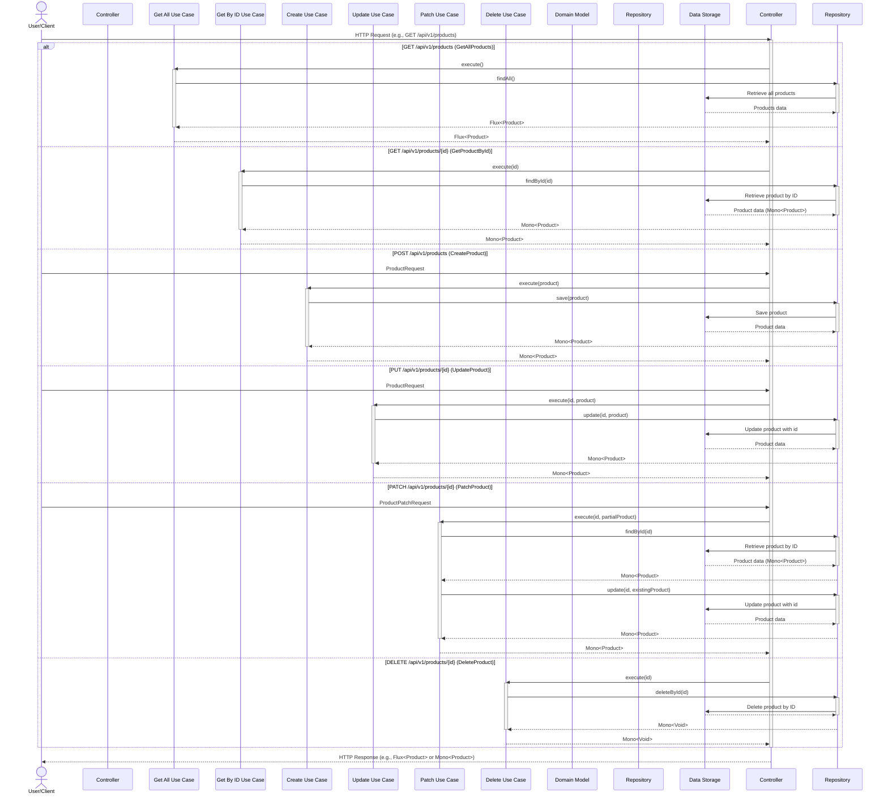

```markdown
# Spring Boot Reactive Product API

A reactive REST API for managing product inventory, built with Spring Boot WebFlux. This API provides CRUD operations for products, utilizing an in-memory data store.

## Architecture



## Key Features

*   **CRUD Operations:**  Provides endpoints for creating, reading, updating, and deleting products.
*   **Reactive Programming:** Built with Spring WebFlux and Reactor for non-blocking, asynchronous operations.
*   **In-Memory Data Storage:** Uses an in-memory `ConcurrentHashMap` for product persistence.
*   **OpenAPI Documentation:**  Automatically generates API documentation using OpenAPI 3.0 and provides a Swagger UI.
*   **Data Validation:** Utilizes Bean Validation API for validating request bodies.
*   **Containerized Deployment:** Includes a Dockerfile and docker-compose.yml for easy containerization.
*   **Health Check:**  Includes a health check endpoint that probes the `/api/v1/products` endpoint.

## Quick Start

### Prerequisites

*   Java 21
*   Maven

### Building the application

```bash
./mvnw clean package -DskipTests
```

### Running the application

```bash
java -jar target/*.jar
```

or using the Docker Compose file:

```bash
docker-compose up --build
```

## Documentation

*   [Technology Stack](01-technology-stack.md)
*   [Core Features](02-core-features.md)
*   [API Endpoints](03-api-endpoints.md)

## API Usage

Base URL: `/api/v1/products`

### Get All Products

```bash
curl -X GET http://localhost:8080/api/v1/products
```

### Get Product by ID

```bash
curl -X GET http://localhost:8080/api/v1/products/product-id-1
```

### Create a New Product

```bash
curl -X POST \
  http://localhost:8080/api/v1/products \
  -H 'Content-Type: application/json' \
  -d '{
    "name": "New Product",
    "description": "A brand new product",
    "price": 99.99,
    "quantity": 20
  }'
```

### Update Product

```bash
curl -X PUT \
  http://localhost:8080/api/v1/products/product-id-1 \
  -H 'Content-Type: application/json' \
  -d '{
    "name": "Updated Product",
    "description": "An updated product description",
    "price": 149.99,
    "quantity": 30
  }'
```

### Partially Update Product (Patch)

```bash
curl -X PATCH \
  http://localhost:8080/api/v1/products/product-id-1 \
  -H 'Content-Type: application/json' \
  -d '{
    "price": 175.50,
    "quantity": 75
  }'
```

### Delete Product

```bash
curl -X DELETE http://localhost:8080/api/v1/products/product-id-1
```

## Configuration Properties

The following environment variables can be configured through the `docker-compose.yml` file:

*   `SPRING_PROFILES_ACTIVE`:  Sets the active Spring profiles.  Set to `prod` by default in the `docker-compose.yml` file.
*   `JAVA_OPTS`:  Sets JVM options. Default is `-Xmx512m -Xms256m`.

## Docker Deployment

The project can be deployed using Docker. The `Dockerfile` and `docker-compose.yml` files provide a complete deployment configuration.

To build and run the application using Docker Compose:

```bash
docker-compose up --build
```

This will build the Docker image and start the application in a container. The API will be accessible at `http://localhost:8080`. The Swagger UI will be accessible at `http://localhost:8080/swagger-ui.html`.
```